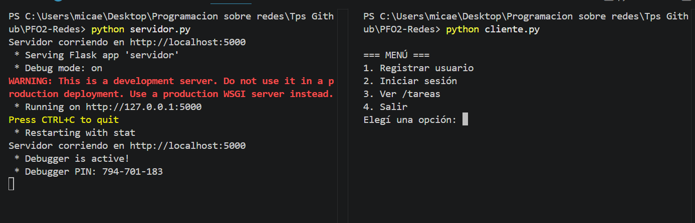
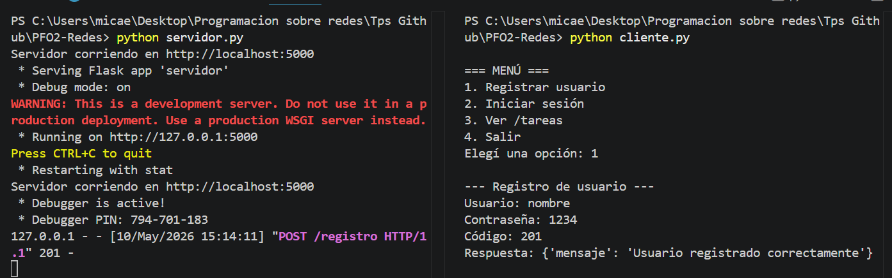
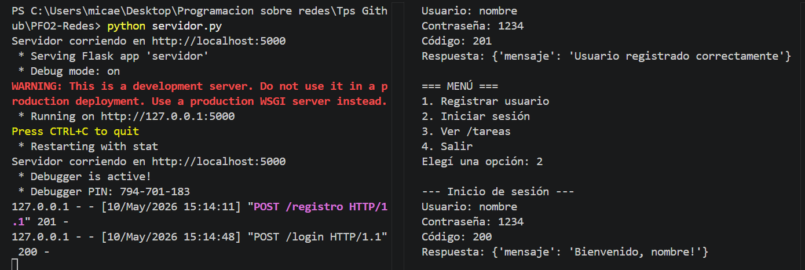
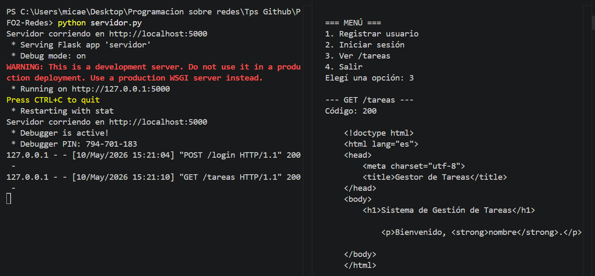
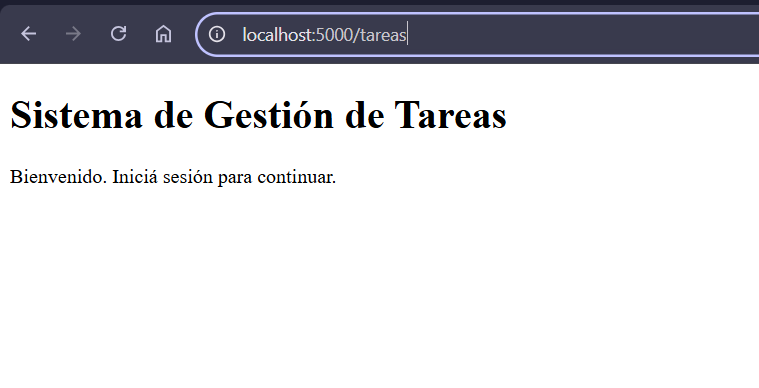
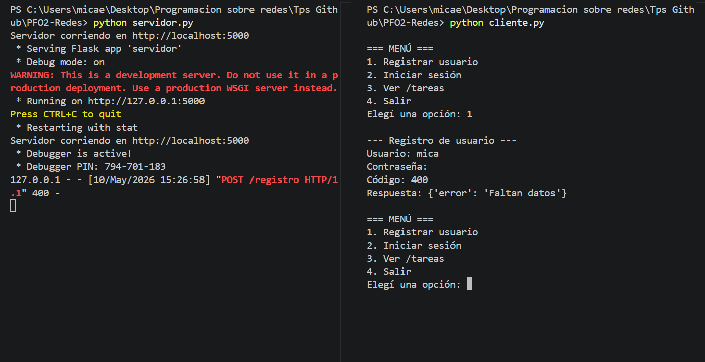
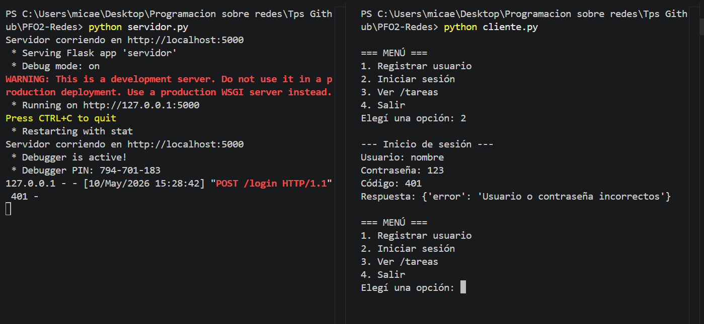
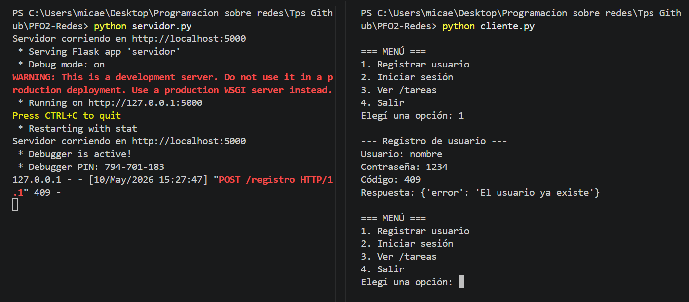

# PFO 2 — Sistema de Gestión de Tareas con API y Base de Datos

Proyecto desarrollado para la materia **Programación sobre Redes**.  
Implementa una **API REST** con **Flask**, autenticación básica con contraseñas hasheadas, persistencia de datos con **SQLite** y un **cliente de consola** para probar los endpoints.

***

## Objetivo

- Implementar una API REST con endpoints funcionales.
- Utilizar autenticación básica con protección de contraseñas.
- Gestionar datos persistentes con SQLite.
- Construir un cliente en consola que interactúe con la API.

***

## Tecnologías utilizadas

- Python 3
- Flask
- SQLite
- Requests
- Werkzeug Security

***

## Estructura del proyecto

```text
PFO2-Redes/
├── servidor.py
├── db.py
├── cliente.py
├── tareas.db
├── README.md
└── images/
```

***

## Archivos principales

### `servidor.py`
Contiene la API Flask con los tres endpoints: `POST /registro`, `POST /login` y `GET /tareas`.

### `db.py`
Contiene las funciones de conexión y acceso a SQLite: `init_db()`, `usuario_existe()`, `crear_usuario()` y `obtener_usuario()`.

### `cliente.py`
Cliente de consola con menú interactivo para probar los endpoints desde terminal.

***

## Instalación

```bash
python -m pip install Flask requests
```

***

## Ejecución

**Terminal 1 — servidor:**

```bash
python servidor.py
```

El servidor se ejecutará en `http://localhost:5000`

**Terminal 2 — cliente:**

```bash
python cliente.py
```

***

## Endpoints

### `POST /registro`

Registra un nuevo usuario con contraseña hasheada.

```json
{
  "usuario": "nombre",
  "contraseña": "1234"
}
```

**Respuesta exitosa (201):**
```json
{ "mensaje": "Usuario registrado correctamente" }
```

***

### `POST /login`

Verifica las credenciales del usuario.

```json
{
  "usuario": "nombre",
  "contraseña": "1234"
}
```

**Respuesta exitosa (200):**
```json
{ "mensaje": "Bienvenido, nombre!" }
```

***

### `GET /tareas`

Muestra una página HTML de bienvenida.  
Accedé desde el navegador: `http://localhost:5000/tareas`

***

# Pruebas realizadas

## Servidor corriendo



---

## Registro exitoso

El usuario se registró correctamente en SQLite y la contraseña fue almacenada hasheada.



---

## Inicio de sesión exitoso

El login verificó correctamente las credenciales del usuario.



---

## Ver `/tareas` desde el cliente

El cliente realizó correctamente la petición `GET /tareas` luego del login.



---

## Ver `/tareas` desde el navegador

La página HTML se muestra correctamente.  
Como no existe una sesión iniciada en el navegador, aparece el mensaje para iniciar sesión.



---

## Manejo de errores

### Error 400 — faltan datos

La API valida que usuario y contraseña sean obligatorios.



---

### Error 401 — usuario o contraseña incorrectos

La API rechaza credenciales inválidas.



---

### Error 409 — usuario ya existente

La API evita registrar dos veces el mismo usuario.



---

***

## Respuestas conceptuales

### ¿Por qué hashear contraseñas?

Una contraseña nunca debe guardarse en texto plano. Si la base de datos se filtra, el hash evita que la contraseña real quede expuesta. `generate_password_hash()` convierte la contraseña en un texto irreversible, y `check_password_hash()` permite verificar las credenciales sin necesidad de almacenar la clave original en ningún momento.

### Ventajas de usar SQLite en este proyecto

- No requiere instalar un servidor de base de datos aparte.
- Toda la información queda en un solo archivo (`tareas.db`).
- El módulo `sqlite3` viene incluido en Python, sin dependencias extra.
- Es simple, liviano y suficiente para un proyecto de esta escala.

***

## Observaciones

- La base de datos `tareas.db` se crea automáticamente al ejecutar el servidor.
- Las contraseñas se almacenan hasheadas, nunca en texto plano.
- El cliente de consola permite probar todos los endpoints de forma interactiva.

***

